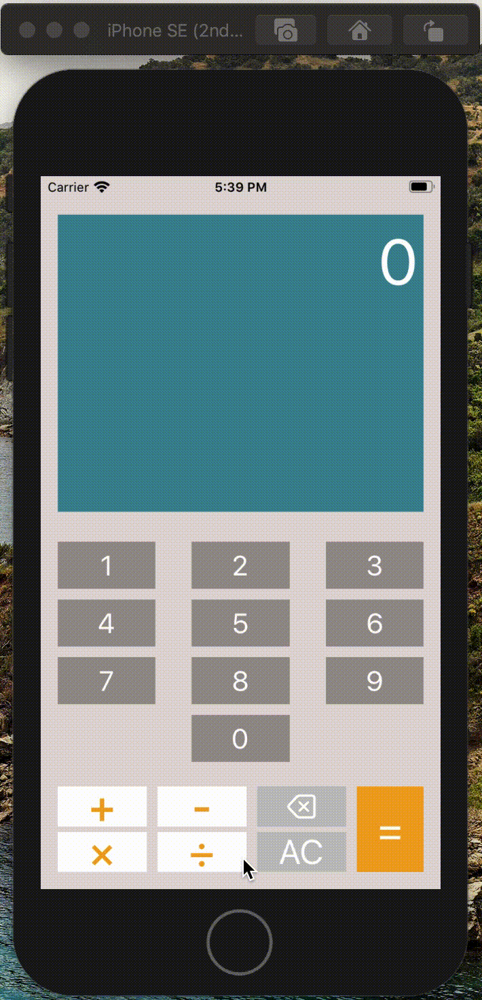
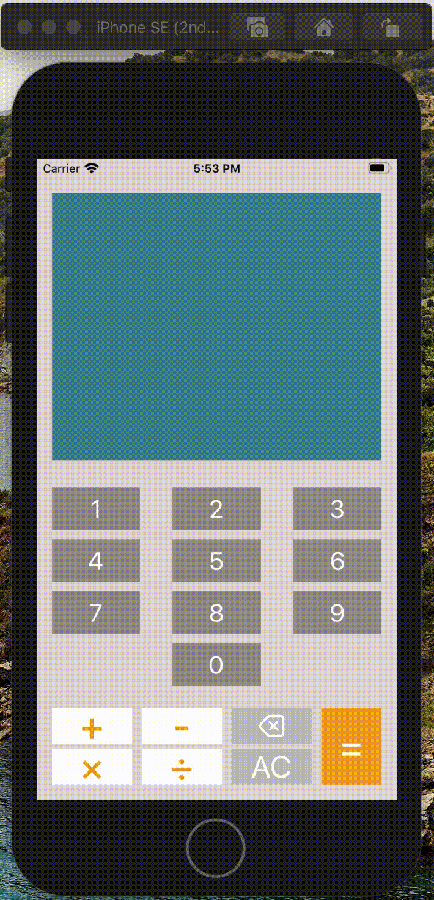
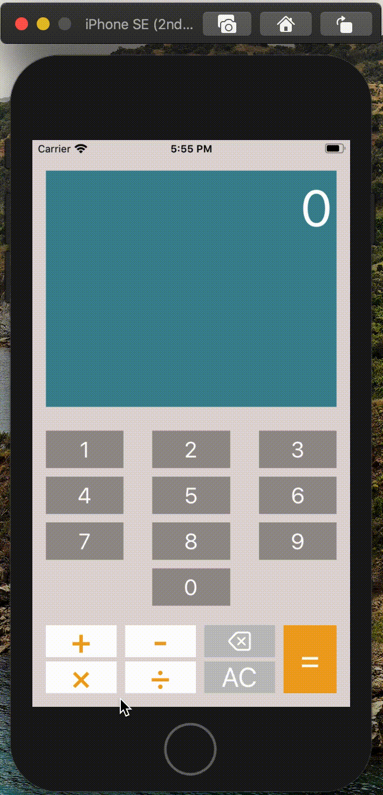

# CountOnMe
This project is the fourth of the iOS Developer path from OpenClassrooms.  
I had to improve an existing app called CountOnMe, a basic calculator, by implementing the multiplication and the division.  
Consequently I also had to handle them according to order of operations.

This app is:

- responsive in all iPhones in portrait mode,
- available from iOS 11,
- conform to MVC,
- covered by unit tests.

6 functionalities are supported.

## Add relative numbers

## Add operators
You can add operators and replace them by another.

## Clear
You can clear a caracter or the whole expression.  
When there is already a result and you tap on the ⌫ button, the whole expression will be cleared.

## Cannot start with "×" or "÷"
You cannot start an expression with a wrong operator even when there is a result.

## Cannot add unnecessary 0
That means you cannot add 0 at the start of the expression or after an operator.  
Thus division by 0 is impossible.

## Alert are presented when the expression is invalid
They are presented when:
- there is not enough elements in the expression (3 minimum),
- the expression ends with an operator
- you tap on the equal button while there is alredy a result.

